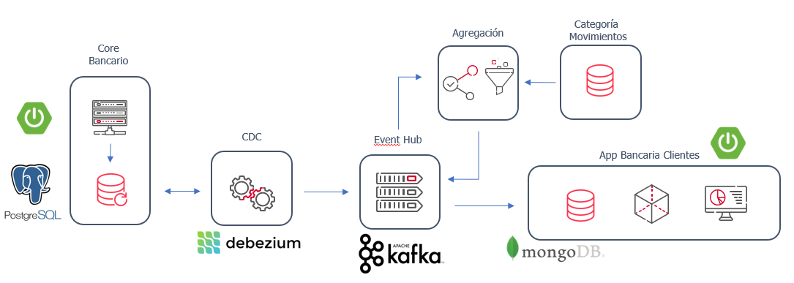
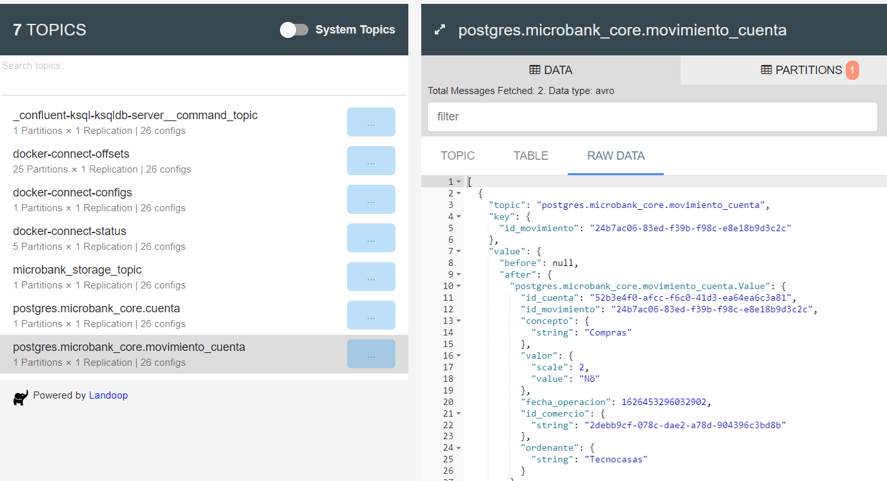

# PoC Change Data Capture (CDC) with Kafka and Debezium

## Introduction

This PoC is aimed to capture all database changes (Change Data Capture - CDC) on data on tables (not yet ready for changes on tables structures) and that data is published as event onto a topic in Kafka. Those events are consumed by other services with any knowledge of the origin of this data. The main goal of the PoC is proving that databases can be offloaded without any instrospection on them and in (near) real time. 

The PoC is based on two main technologies,  __Kafka__  as  _Event Hub_  and  __Debezium__  as tool for extracting data from  _database transaction logs_  (actually Debezium is specialized Kafka Conector and build on top of Kafka). 
Also the PoC is extracting data from a Postgres database, and for Demo porpouses Core and Client applications are developed with SpringBoot and MongoDB. 




## Requirements

- Docker 
- Maven 3
- Java 11
- Postman or curl or other http client.

This code has been tested with:
 - Docker Desktop v3.5.2 for Mac, v3.5.1 for Windows
 - Engine v20.20.7, v20.10.7
 - Compose 1.29.2
 - 2 vCPU and 4 GB RAM (resources for docker virtual machine in a laptop with 16 GB RAM and 4 cores)


## Repository Structure

The repository is structured in several folders depending on its responsibility:

-  __docs__  : all documents, markdowns and images related to documentation of the project
-  __platform__  : folder used by storing infrastructure components rely on platform where project is going to be deployed. 
It can be local, innershift or cloud.

## Infraestructure Setup

This project has three different setups: local, inneshift and cloud.
So far it is only available local setup
These configurations are detailed below:

## Local Setup

This code has been tested with:
 - Docker Desktop v3.5.2
 - Engine v20.20.7
 - Compose 1.29.2
 - 2 vCPU and 4 GB RAM (resources for docker virtual machine in a laptop with 16 GB RAM and 4 cores)


1. Start up all containers needed for PoC. Move to platform/local folder and run:
    
    docker compose -p "cdc-debezium" up
    
 This will take a few minutes first time to download all images. This also will create a folder all persisted data on local volume. 
2. Verify that all containers are up. Note: you must have enough memory ram configured inthe docker virtual machine to run all containers
3. In this point if you access to Kafka Connect UI (http://localhost:8003) it should show none connectors
4. Run this command to register the Debezium connector for postgres database:

```
curl -X POST \
  http://localhost:8083/connectors/ \
  -H 'Accept: application/json' \
  -H 'Content-Type: application/json' \
  -H 'cache-control: no-cache' \
  -d '{ 
    "name": "microbank-core-connector",
    "config": {
        "connector.class": "io.debezium.connector.postgresql.PostgresConnector",
        "tasks.max": "1",
        "database.hostname": "postgres",
        "database.port": "5432",
        "database.user": "microbank",
        "database.password": "microbank",
        "database.dbname" : "postgres",
        "database.server.name": "postgres",
        "database.history.kafka.bootstrap.servers": "kafka:9092"
    }
}'
```

And it should response something like this:

```
{
   "name":"microbank-core-connector",
   "config":{
      "connector.class":"io.debezium.connector.postgresql.PostgresConnector",
      "tasks.max":"1",
      "database.hostname":"postgres",
      "database.port":"5432",
      "database.user":"microbank",
      "database.password":"microbank",
      "database.dbname":"postgres",
      "database.server.name":"postgres",
      "database.history.kafka.bootstrap.servers":"kafka:9092",
      "name":"microbank-core-connector"
   },
   "tasks":[],
}
```
In order to check that connector is correctly installed execute following request:

```
curl --location --request GET 'localhost:8083/connectors?expand=info&expand=status' \
--header 'Accept: application/json' \
--header 'Content-Type: application/json'
```

The response should be this:

```
{
    "microbank-core-connector": {
        "info": {
            "name": "microbank-core-connector",
            "config": {
                "connector.class": "io.debezium.connector.postgresql.PostgresConnector",
                "database.user": "microbank",
                "database.dbname": "postgres",
                "tasks.max": "1",
                "database.hostname": "postgres",
                "database.password": "microbank",
                "database.history.kafka.bootstrap.servers": "kafka:9092",
                "name": "microbank-core-connector",
                "database.server.name": "postgres",
                "database.port": "5432"
            },
            "tasks": [
                {
                    "connector": "microbank-core-connector",
                    "task": 0
                }
            ],
            "type": "source"
        },
        "status": {
            "name": "microbank-core-connector",
            "connector": {
                "state": "RUNNING",
                "worker_id": "kafka-connect:8083"
            },
            "tasks": [
                {
                    "id": 0,
                    "state": "RUNNING",
                    "worker_id": "kafka-connect:8083"
                }
            ],
            "type": "source"
        }
    }
}
```

5. Access to <http://localhost:8003/#/cluster/kafka-connect-1> to verify that the connector has been registered to the postgres database

6. Connect to postgres database:

```SQL 
psql -h localhost -p 5432 -d postgres -U microbank
```

6. And run the next scripts (note that Debezium's postgres connector not detect DDL changes, only DML changes)

```SQL
-- DROP SCHEMA microbank_core;
CREATE SCHEMA microbank_core AUTHORIZATION "microbank";

-- Drop table
-- DROP TABLE microbank_core.cuenta;
CREATE TABLE microbank_core.cuenta (
    id_cuenta uuid NOT NULL,
    num_cuenta numeric NOT NULL,
    titular_cuenta text NOT NULL,
    CONSTRAINT cuenta_pk PRIMARY KEY (id_cuenta)
);

-- Drop table
-- DROP TABLE microbank_core.movimiento_cuenta;
CREATE TABLE microbank_core.movimiento_cuenta (
    id_cuenta uuid NOT NULL,
    id_movimiento uuid NOT NULL,
    concepto text NULL,
    valor numeric NOT NULL,
    fecha_operacion timestamp NOT NULL,
    id_comercio uuid NULL,
    ordenante text NULL,
    CONSTRAINT movimiento_cuenta_pk PRIMARY KEY (id_movimiento)
);

ALTER TABLE microbank_core.movimiento_cuenta ADD CONSTRAINT movimiento_cuenta_fk FOREIGN KEY (id_cuenta) REFERENCES microbank_core.cuenta(id_cuenta);
```

```SQL
insert into microbank_core.cuenta values (uuid_in(md5(random()::text || clock_timestamp()::text)::cstring),1234567890,'Cuenta de prueba');

insert into microbank_core.movimiento_cuenta (id_cuenta,id_movimiento,concepto,valor,fecha_operacion,id_comercio,ordenante)
select
    id_cuenta,uuid_in(md5(random()::text || clock_timestamp()::text)::cstring),'Compras',202.14,current_timestamp,uuid_in(md5(random()::text || clock_timestamp()::text)::cstring),'Tecnocasas'
from microbank_core.cuenta;
```

Note: the second insert sentence only 'work' if there is only one account in microbank_core.cuenta table (of course, this inserts only are a fast data example)

7. Access to <http://localhost:8000/> to view the events created in the topics. Note one topic is created for each table that has ddl sentences (insert, update or delete)




8. Start containers for MongoDB used by Microbank client. In the folder platform/local run:
    
    docker compose -f docker-compose-mongo.yaml -p "mongo-microbank" up

## FAQs

1. If Kafka connector has to be recreated, first it has to be deleted executing:

```
curl --location --request DELETE 'localhost:8083/connectors/microbank-core-connector' \
--header 'Accept: application/json' \
--header 'Content-Type: application/json'
```
Then the connector can be created like it is described in setup process step 4.

2. Sometimes when a Kafka connector for debezium is deleted, the slot name for postgres must be deleted also or create a new connector with different
slot name. For creating with new slot name execute this request:

```
curl -X POST \
  http://localhost:8083/connectors/ \
  -H 'Accept: application/json' \
  -H 'Content-Type: application/json' \
  -H 'cache-control: no-cache' \
  -d '{ 
    "name": "microbank-core-connector",
    "config": {
        "connector.class": "io.debezium.connector.postgresql.PostgresConnector",
        "tasks.max": "1",
        "database.hostname": "postgres",
        "database.port": "5432",
        "database.user": "microbank",
        "database.password": "microbank",
        "database.dbname" : "postgres",
        "database.server.name": "postgres",
        "database.history.kafka.bootstrap.servers": "kafka:9092",
        "slot.name" : "my-slot-name"
    }
}'

```

Otherwise, delete the slot name in postgres ddbb executing this command:

```
select pg_drop_replication_slot('debezium');
```

The default slot name if it is not explicitally named is 'debezium'.

More info about this issue <https://stackoverflow.com/questions/50746419/replication-slot-already-exists>
 

## Useful links
- Confluent Platform Kafka versions: <https://docs.confluent.io/platform/current/installation/versions-interoperability.html>
- Confluent Docker Compose: <https://github.com/confluentinc/cp-all-in-one/blob/6.2.0-post/cp-all-in-one/docker-compose.yml>

- Kafka Connect UI: <http://localhost:8003/>
- Kafka Topics UI: <http://localhost:8000/>
- Kafka Schema Registry UI: <http://localhost:8001/>